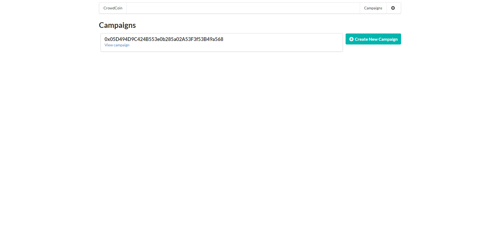
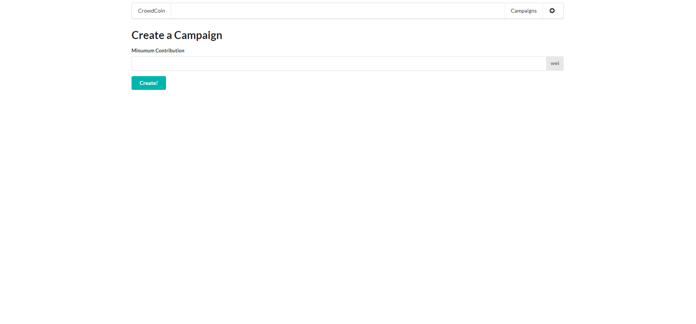
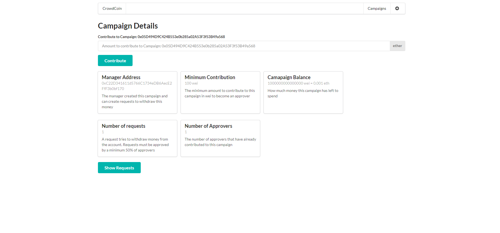
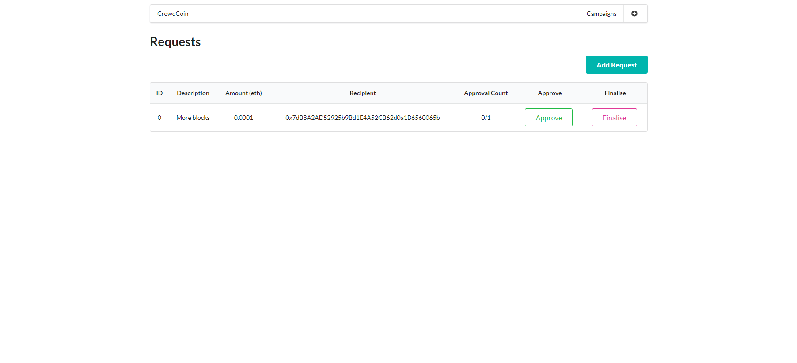
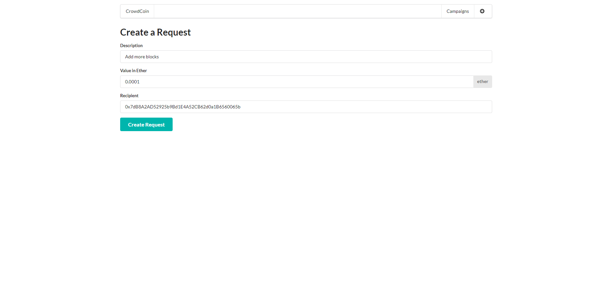
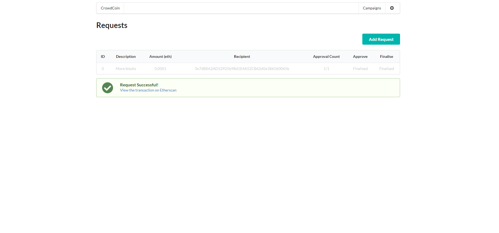

# solidity-react-campaign

Project build off Stephen Griders Udemy course: Ethereum and Solidity: The Complete Developer's Guide

## Available commands

### Compile

Compiles the project generating the abi and the bytecode.

```bash
$ node compile
```

### Deploy

Deploys the project and create a file with the respective address

```bash
$ node deploy
```

> **_REMINDER TO SELF:_** ADDED ENVIRONMENT VARIABLE TO HIDE MY MNEMONIC PHRASE AND INFURA LINK AFTER DEPLOYMENT

### Test

Runs the mocha tests for the smart contracts.

```bash
$ npm run test
```

### Development server

Starts the development server.

```bash
$ npm run dev
```

## Overview

### Root Page - Campaigns List



### Create Campaign Page



### Campaign Details Page



### Requests List



### New Request Form



### Approved & Finalized Request Form


